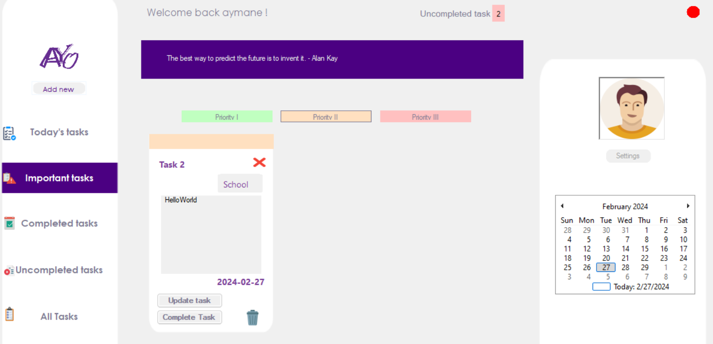

# YAO - Your Assistant Organizer

YAO is a .NET application designed for efficient time and task management. It provides users with the ability to organize their tasks, set priorities, deadlines, and categories, and manage their personal information.

## Features

- **User Accounts:** Each user has a personalized account to manage their tasks and personal information.
- **Task Management:** Users can add, update, delete, and prioritize tasks. Tasks are categorized as today's tasks, completed tasks, and all tasks.
- **Task Sorting:** Users can sort tasks by priority or category (e.g., home, school).
- **Personal Information:** Users can update their personal information, including their avatar.
- **Random Quotes:** The homepage displays random quotes each time a user logs in, providing inspiration and motivation.
- **Task Reminder:** An icon indicates the number of tasks that need to be completed, helping users stay organized and focused.




## Installation

1. Clone the repository:

    ```bash
    git clone https://github.com/Astronaum/YAO.git
    cd YAO
    ```

2. Install dependencies:

    ```bash
    dotnet restore
    ```

3. Build the application:

    ```bash
    dotnet build
    ```

4. Run the application:

    ```bash
    dotnet run
    ```

## Usage

1. Register for a new account or log in with existing credentials.
2. Once logged in, you will be directed to your homepage displaying random quotes and task statistics.
3. Navigate to the task management section to add, update, delete, prioritize, and categorize tasks.
4. Update your personal information and avatar as needed.
5. Explore the sorting options to organize tasks by priority or category.
6. Stay productive and focused with task reminders.

## Contributing

Contributions to YAO are welcome! Follow these steps to contribute:

1. Fork the repository.
2. Create a new branch (`git checkout -b feature-branch`).
3. Make your changes and commit them (`git commit -am 'Add new feature'`).
4. Push to the branch (`git push origin feature-branch`).
5. Create a new pull request.
